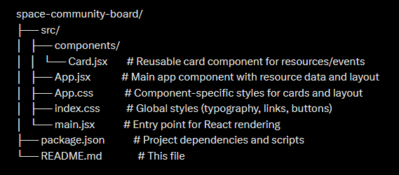

# Space Exploration Community Board

## Overview
The **Space Exploration Community Board** is a web application built with **React**, **Vite**, and **JavaScript**. It serves as a resource and event hub for space enthusiasts, featuring a responsive card-based layout that showcases 10 unique space-related resources and events—such as NASA live streams, virtual telescope sessions, and Mars rover updates. The project uses functional components and table-based styling to create a visually appealing, space-themed interface.

This project was an opportunity to deepen my understanding of modern front-end development, component-based architecture, and responsive design.

---

## Features
- **Responsive Design**: Cards adjust from 3 columns (desktop) to 2 (tablet) or 1 (mobile) based on screen size.
- **Space Theme**: A dark, cosmic aesthetic with cyan and green accents inspired by space exploration.
- **Functional Components**: Built using React hooks and modular components.
- **Table Layout**: Utilizes `<table>`, `<tr>`, and `<td>` for structured card placement.
- **Global & Scoped Styling**: Combines global styles (`index.css`) with component-specific styles (`App.css`).

---

## What I Learned
Through this project, I gained hands-on experience and insights in the following areas:

1. **React Fundamentals**:
   - Creating and reusing functional components (e.g., `Card.jsx`).
   - Managing component props to dynamically render content.
   - Structuring a React app with a component folder and modular design.

2. **Responsive Design**:
   - Implementing media queries to adapt layouts for different screen sizes.
   - Using CSS techniques to ensure a seamless user experience across devices.

3. **Styling in React**:
   - Combining global styles (`index.css`) with scoped styles (`App.css`).
   - Leveraging CSS variables and color schemes for theming.
   - Styling tables creatively to achieve a card-based layout.

4. **Vite Tooling**:
   - Setting up a fast development environment with Vite.
   - Understanding the default file structure (`App.jsx`, `main.jsx`, etc.) and customizing it.

5. **Problem-Solving**:
   - Dynamically splitting an array of resources into rows of 3 using `Array(Math.ceil())` and `slice()`.
   - Balancing global and local CSS to avoid style conflicts.

6. **Theming**:
   - Crafting a cohesive space-inspired design with a dark background and vibrant accents.
   - Ensuring accessibility with readable text contrast.

---

## Project Structure



---

## Installation & Setup
1. **Clone the Repository**:
   ```bash
   git clone 
   cd space-community-board

2. **Install Dependencies**:
- Ensure Node.js and npm are installed.
- Run:
  ```
  npm install
  ```
- Installs react, react-dom, and Vite dependencies as listed in package.json.

3. **Run the Project**:
npm run dev

- Opens at http://localhost:5173 (Vite’s default port) in your browser.

## Technologies Used
- **React**: For building the UI with functional components.
- **Vite**: For fast development and bundling.
- **JavaScript**: Core logic and data management.
- **CSS**: Styling with a mix of global and scoped approaches.

---
## Future Improvements
- Add interactivity (e.g., filtering resources by category).
- Incorporate a backend to fetch real-time event data.
- Enhance accessibility with ARIA labels and keyboard navigation.
- Add animations for card hover effects or page transitions.

---

## Acknowledgments
- Inspired by my fascination with space exploration and community-driven learning.
- First week's project for codePath's web102

